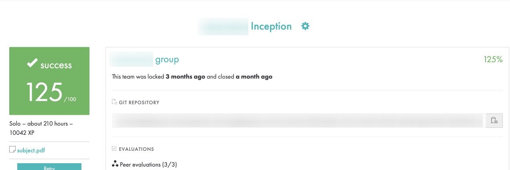

# 🐳 Inception — 42 School Project

Inception is a system administration and ***DevOps*** project from ***School 42***. The goal is to create a secure and functional infrastructure using ***Docker Compose***, deploying several services in isolated containers.

## Project Description

Inception is a ***42 School*** project focused on system administration and ***DevOps*** fundamentals. It aims to build a secure, modular infrastructure with ***Docker*** and ***Docker Compose***. Services include ***WordPress***, ***Nginx***, ***MariaDB***, ***Redis***, ***FTP***, ***Adminer***, ***Portainer***, and a static website.

## 📸 Preview



## Services

- Nginx (reverse proxy with SSL)  
- WordPress  
- MariaDB  
- Redis  
- FTP (FTPS)  
- Adminer  
- Portainer  
- Static website  

## Technologies

Docker, Docker Compose, Bash, Nginx, MariaDB, WordPress, Redis, vsftpd (FTP), Adminer, Portainer.

## Project Goals

- Dockerize all services  
- Secure with SSL (self-signed)  
- Persistent data with volumes  
- Secure FTP access  
- Proper container networking  

## Directory Structure

```
inception/
├── srcs/
│   ├── requirements/
│   │   ├── nginx/
│   │   ├── wordpress/
│   │   ├── mariadb/
│   │   ├── redis/
│   │   ├── ftp/
│   │   ├── adminer/
│   │   └── portainer/
│   └── docker-compose.yml
├── .env
|-- Makefile
└── README.md
```

## How to Run

1. Clone repo:

```bash
git clone https://github.com/serg-backend-developer/inception.git
cd inception
```

2. Create/edit `.env` file (example):

```
WP_TITLE=smth
WP_CACHE_KEY_SALT=login.42.fr
WP_ADMIN_USER=user
WP_ADMIN_PASSWORD=adminpassword
WP_ADMIN_EMAIL=login@42.fr
WP_DB_HOST=mariadb
WP_DB_CHARSET=utf8
DB_NAME=inception_db
DB_USER=user42
DB_PASSWORD=secretpassword
DB_ROOT_PASSWORD=rootsecretpassword
WP_USER=evaluator
WP_USER_PASSWORD=evaluatorpassword
WP_USER_EMAIL=evaluator@42.fr
FTP_USER=ftpuser
FTP_PASSWORD=ftppassword
WP_REDIS_HOST=redis
WP_REDIS_PORT=6379
```

3. Build and start containers:

```bash
docker-compose up --build -d
```

4. Check containers:

```bash
docker-compose ps
```

5. Stop containers:

```bash
docker-compose down
```

## Access URLs

- WordPress: https://localhost  
- Adminer: https://localhost:8080  
- Portainer: https://localhost:9443  
- FTP: connect via FTPS with credentials from `.env`

## Security Note

SSL certificates are self-signed for development only. Use trusted CA certs for production.

## Author

[GitHub](https://github.com/serg-backend-developer)

## License

Educational use only under 42 school rules.
